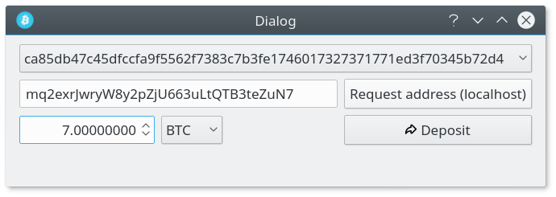
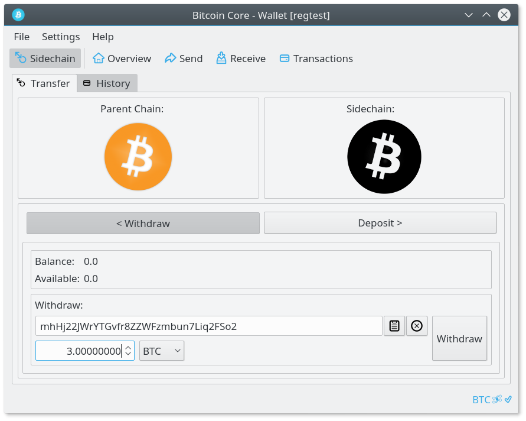
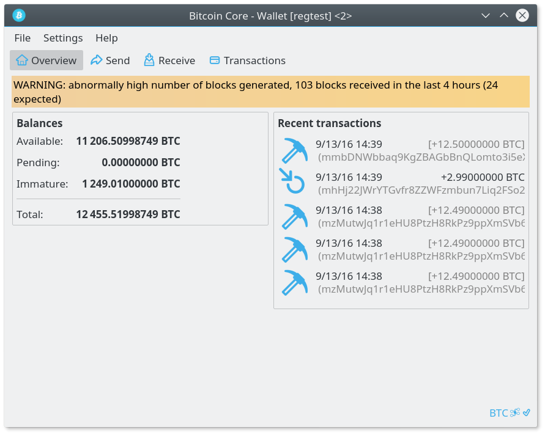

Testing Drivechains
===================

Setup
-----

### Mainchain (bitcoin) setup

- Download (clone)
```
git clone https://github.com/drivechain-project/mainchain.git
```

- Build
```
./autogen.sh
./configure (optional: --with-incompatible-bdb --disable-tests)
make
```

- Data directory

You will need to create a new data directory to store files for the mainchain
(bitcoin). In this example a new directory 'drivechainMain' will be created in
your home directory.
```
mkdir ~/drivechainMain
```

- Configuration file

Copy the main.conf configuration file from

[Drivechain testing repository](https://github.com/drivechain-project/testing)

to ~/drivechainMain/bitcoin.conf

### Sidechain setup
- Download (clone)
```
git clone https://github.com/drivechain-project/sidechain.git
```

- Build
```
./autogen.sh
./configure (optional: --with-incompatible-bdb --disable-tests)
make
```

- Data directory

You will need to create a new data directory to store the blockchain, DB etc
for the sidechain. In this example a new directory 'drivechainSide ' will be
created in your home directory.
```
mkdir ~/drivechainSide
```

- Configuration file

Copy the side.conf configuration file from

[Drivechain testing repository](https://github.com/drivechain-project/testing)

to ~/drivechainSide/bitcoin.conf

Testing (manual)
----------------

- Start mainchain (bitcoin)

From the directory you built the mainchain; `replace $USERNAME with your username!`
```
./src/qt/bitcoin-qt --datadir=/home/$USERNAME/drivechainMain/
```

- Start sidechain

From the directory you built the sidechain; `replace $USERNAME with your username!`
```
./src/qt/bitcoin-qt --datadir=/home/$USERNAME/drivechainSide/
```

Both clients (sidechain & mainchain) should start in regtest mode, note the blue icon, with 0 blocks each. If not, you need to make sure you saved the configuration files correctly and started the clients with the proper datadir specified.

- Mine 101 blocks on both chains to get coins

Open the debug window, switch to the console tab and enter:
```
generate 101
```

Do this on both mainchain and sidechain. If you have a slower computer or a VPS you
should split up the generation into multiple commands ex: `generate 50` `generate 51`.

- Create testing sidechain ca85db47c45dfccfa9f5562f7383c7b3fe1746017327371771ed3f70345b72d4

From the console tab of the `mainchain` debug window enter:
```
createsidechain 200 200 200
```
and to add it to the database:
```
generate 1
```

You should now see the sidechain in the DB if you make the following RPC call:
```
listsidechains

[
  {
    "id": "ca85db47c45dfccfa9f5562f7383c7b3fe1746017327371771ed3f70345b72d4",
    "nHeight": 102
  }
]
```

- Deposit to sidechain

Go to the send page of the `mainchain` bitcoin-qt client, click send (sidechain) which is located at the bottom of
the page next to the normal send button. This will show the sidechain deposit dialog.

Get a new address from the `sidechain` client by either generating one on the receive page, or running `getnewaddress`
in the RPC console.

Paste the address you just generated on the sidechain into the sidechain deposit dialog open
in the `mainchain` client.

Enter the amount you wish to deposit, in this example we will send 7 BTC to the sidechain.



Click the deposit button, you should see the transaction popup alert stating the amount sent etc.

Generate a block on `mainchain` to add the deposit to the DB.
```
generate 1
```

You should now see the deposit by running this command in the `mainchain` RPC:
```
listsidechaindeposits ca85db47c45dfccfa9f5562f7383c7b3fe1746017327371771ed3f70345b72d4

[
  {
    "depositid": "e749a38e8efb60cecd4ca8b26c50ff2d40db3e42b53e6702dd70c73f44e2d11e",
    "txid": "fb9c91e995233d5b036b42dd20a1420b5549f8377e6ec88db36343bb4db1473d",
    "nHeight": 103,
    "dtHash": "792c01e0b44cddf648aa35fcd501f62bd6bb0144bc00d3548785d01d27177fd6",
    "sidechainid": "ca85db47c45dfccfa9f5562f7383c7b3fe1746017327371771ed3f70345b72d4",
    "keyID": "54929472b381dde789b5a284da5909e9c5245768"
  }
]
```

- Generate blocks on sidechain

From the console tab of the `sidechain` debug window:
```
generate 1
```
If everything worked so far, you will see that 7 BTC have been deposited from the bitcoin mainchain
into the sidechain address that you specified.

- Withdraw from sidechain

Go back to the `sidechain` client again, and click on the 'Sidechain' toolbar button (far left, next to overview)
and you will see the options available (deposit / withdraw)

Click withdraw, enter the `mainchain` bitcoin address that you would like to withdraw to,
and the amount to withdraw. In this example we will withdraw 3 BTC to the bitcoin mainchain from the sidechain.



Click withdraw to submit your wt

- Generate blocks on sidechain to create and broadcast WT^

Generate enough blocks on the `sidechain` client so that the block height reaches 401,
triggering the creation by the sidechain of WT^, which will be broadcast automatically
to the bitcoin mainchain.

- Generate blocks on mainchain to discover the WT^

Generate a block on the mainchchain to add the WT^ to the DB and start the verification process
```
generate 1
```

Now you should see that the WT^ has been recognized by the bitcoin mainchain, and the verification
process will begin starting with the next block.
```
listsidechainwithdraws ca85db47c45dfccfa9f5562f7383c7b3fe1746017327371771ed3f70345b72d4

[
  {
    "id": "c761a8a24831b7691526bfdd763ae34455c00e8a51d4bf905a39671f0b8d65c3",
    "nHeight": 104
  }
]
```
- Finally, generate blocks on mainchain to trigger WT^ payout

You must generate enough blocks on mainchain  for the miners
to increment the workscore of the WT^ up to minworkscore. If everything
worked out correctly you will see your `sidechain` withdraw deposited into
the `mainchain` bitcoin address that you specified.

Generate enough blocks on the `mainchain` to get your block height
over 400, and you should see that the 3 BTC minus a fee has been
deposited back into your mainchain address.



If you received the 3 (~2.9) BTC withdraw from the mainchain, thats it, it worked.

Testing (automated) TODO
------------------------
